# מאזן – Database Schema & ERD

## Database Technology

- **Primary Database**: PostgreSQL 16
- **Caching Layer**: Redis 7
- **Search**: PostgreSQL Full-Text Search (Hebrew support via pg_catalog)
- **Time-Series**: TimescaleDB extension (for investment/market data)

---

## ERD Diagram (Mermaid)

```mermaid
erDiagram
    USERS ||--o{ HOUSEHOLDS : "belongs_to"
    USERS ||--o{ ACCOUNTS : "owns"
    USERS ||--o{ USER_PREFERENCES : "has"
    USERS ||--o{ AUDIT_LOGS : "generates"
    USERS ||--o{ AI_CONVERSATIONS : "initiates"
    USERS ||--o{ NOTIFICATIONS : "receives"
    
    HOUSEHOLDS ||--o{ HOUSEHOLD_MEMBERS : "contains"
    HOUSEHOLDS ||--o{ SHARED_GOALS : "has"
    HOUSEHOLDS ||--o{ SPLITTING_RULES : "defines"
    HOUSEHOLDS ||--o{ HOUSEHOLD_BUDGETS : "manages"
    
    ACCOUNTS ||--o{ TRANSACTIONS : "contains"
    ACCOUNTS ||--o{ RECURRING_TRANSACTIONS : "has"
    
    TRANSACTIONS ||--o{ TRANSACTION_TAGS : "tagged_with"
    TRANSACTIONS ||--o{ TRANSACTION_SPLITS : "split_into"
    TRANSACTIONS }o--|| CATEGORIES : "categorized_as"
    
    CATEGORIES ||--o{ CATEGORY_RULES : "has"
    CATEGORIES ||--o{ BUDGET_ALLOCATIONS : "allocated_in"
    
    USERS ||--o{ GOALS : "sets"
    GOALS ||--o{ GOAL_CONTRIBUTIONS : "receives"
    GOALS ||--o{ GOAL_MILESTONES : "has"
    
    USERS ||--o{ INVESTMENTS : "holds"
    INVESTMENTS }o--|| ASSET_PRICES : "priced_by"
    INVESTMENTS ||--o{ INVESTMENT_TRANSACTIONS : "has"
    
    USERS ||--o{ PENSION_FUNDS : "enrolled_in"
    PENSION_FUNDS ||--o{ PENSION_CONTRIBUTIONS : "receives"
    
    USERS ||--o{ MORTGAGES : "has"
    MORTGAGES ||--o{ MORTGAGE_TRACKS : "composed_of"
    MORTGAGE_TRACKS ||--o{ MORTGAGE_PAYMENTS : "has"
    
    USERS ||--o{ LIFE_EVENTS : "plans"
    USERS ||--o{ FINANCIAL_SCORES : "scored_with"
    USERS ||--o{ REPORTS : "generates"
    
    AI_CONVERSATIONS ||--o{ AI_MESSAGES : "contains"
    USERS ||--o{ AI_MEMORY : "stored_for"
    
    USERS ||--o{ SIMULATIONS : "runs"
```



---

## Complete Schema Definition

### Core Tables

```sql
-- =====================================================
-- USERS & AUTHENTICATION
-- =====================================================

CREATE TABLE users (
    id UUID PRIMARY KEY DEFAULT gen_random_uuid(),
    email VARCHAR(255) UNIQUE NOT NULL,
    email_verified BOOLEAN DEFAULT FALSE,
    password_hash VARCHAR(255), -- NULL for OAuth-only users
    first_name VARCHAR(100) NOT NULL,
    last_name VARCHAR(100) NOT NULL,
    phone VARCHAR(20),
    date_of_birth DATE,
    gender VARCHAR(20),
    avatar_url TEXT,
    preferred_language VARCHAR(5) DEFAULT 'he', -- 'he' or 'en'
    preferred_currency VARCHAR(3) DEFAULT 'ILS',
    timezone VARCHAR(50) DEFAULT 'Asia/Jerusalem',
    employment_type VARCHAR(20), -- 'employed', 'self_employed', 'both', 'unemployed', 'retired'
    onboarding_completed BOOLEAN DEFAULT FALSE,
    subscription_tier VARCHAR(20) DEFAULT 'free', -- 'free', 'premium', 'family', 'professional'
    subscription_expires_at TIMESTAMPTZ,
    mfa_enabled BOOLEAN DEFAULT FALSE,
    mfa_secret VARCHAR(255),
    last_login_at TIMESTAMPTZ,
    created_at TIMESTAMPTZ DEFAULT NOW(),
    updated_at TIMESTAMPTZ DEFAULT NOW(),
    deleted_at TIMESTAMPTZ -- Soft delete
);

CREATE TABLE oauth_accounts (
    id UUID PRIMARY KEY DEFAULT gen_random_uuid(),
    user_id UUID NOT NULL REFERENCES users(id) ON DELETE CASCADE,
    provider VARCHAR(50) NOT NULL, -- 'google', 'microsoft'
    provider_user_id VARCHAR(255) NOT NULL,
    access_token_encrypted TEXT,
    refresh_token_encrypted TEXT,
    token_expires_at TIMESTAMPTZ,
    created_at TIMESTAMPTZ DEFAULT NOW(),
    UNIQUE(provider, provider_user_id)
);

CREATE TABLE refresh_tokens (
    id UUID PRIMARY KEY DEFAULT gen_random_uuid(),
    user_id UUID NOT NULL REFERENCES users(id) ON DELETE CASCADE,
    token_hash VARCHAR(255) NOT NULL UNIQUE,
    device_info JSONB,
    ip_address INET,
    expires_at TIMESTAMPTZ NOT NULL,
    revoked_at TIMESTAMPTZ,
    created_at TIMESTAMPTZ DEFAULT NOW()
);

CREATE TABLE user_preferences (
    id UUID PRIMARY KEY DEFAULT gen_random_uuid(),
    user_id UUID NOT NULL REFERENCES users(id) ON DELETE CASCADE UNIQUE,
    notification_email BOOLEAN DEFAULT TRUE,
    notification_push BOOLEAN DEFAULT TRUE,
    notification_sms BOOLEAN DEFAULT FALSE,
    weekly_report BOOLEAN DEFAULT TRUE,
    monthly_report BOOLEAN DEFAULT TRUE,
    ai_proactive_alerts BOOLEAN DEFAULT TRUE,
    dashboard_layout JSONB DEFAULT '{}',
    risk_tolerance VARCHAR(20) DEFAULT 'moderate', -- 'conservative', 'moderate', 'aggressive'
    financial_goals_priority JSONB DEFAULT '[]',
    created_at TIMESTAMPTZ DEFAULT NOW(),
    updated_at TIMESTAMPTZ DEFAULT NOW()
);

-- =====================================================
-- HOUSEHOLDS & COUPLES
-- =====================================================

CREATE TABLE households (
    id UUID PRIMARY KEY DEFAULT gen_random_uuid(),
    name VARCHAR(100) NOT NULL,
    type VARCHAR(20) NOT NULL, -- 'individual', 'couple', 'family'
    created_by UUID NOT NULL REFERENCES users(id),
    created_at TIMESTAMPTZ DEFAULT NOW(),
    updated_at TIMESTAMPTZ DEFAULT NOW()
);

CREATE TABLE household_members (
    id UUID PRIMARY KEY DEFAULT gen_random_uuid(),
    household_id UUID NOT NULL REFERENCES households(id) ON DELETE CASCADE,
    user_id UUID NOT NULL REFERENCES users(id) ON DELETE CASCADE,
    role VARCHAR(20) NOT NULL DEFAULT 'member', -- 'owner', 'member'
    joined_at TIMESTAMPTZ DEFAULT NOW(),
    UNIQUE(household_id, user_id)
);

CREATE TABLE splitting_rules (
    id UUID PRIMARY KEY DEFAULT gen_random_uuid(),
    household_id UUID NOT NULL REFERENCES households(id) ON DELETE CASCADE,
    name VARCHAR(100) NOT NULL,
    type VARCHAR(30) NOT NULL, -- 'equal', 'proportional', 'category_based', 'fixed', 'custom'
    config JSONB NOT NULL, -- Rule configuration
    is_default BOOLEAN DEFAULT FALSE,
    created_at TIMESTAMPTZ DEFAULT NOW(),
    updated_at TIMESTAMPTZ DEFAULT NOW()
);

CREATE TABLE household_budgets (
    id UUID PRIMARY KEY DEFAULT gen_random_uuid(),
    household_id UUID NOT NULL REFERENCES households(id) ON DELETE CASCADE,
    month DATE NOT NULL, -- First day of month
    total_budget NUMERIC(12,2),
    created_at TIMESTAMPTZ DEFAULT NOW(),
    updated_at TIMESTAMPTZ DEFAULT NOW(),
    UNIQUE(household_id, month)
);

-- =====================================================
-- FINANCIAL ACCOUNTS
-- =====================================================

CREATE TABLE accounts (
    id UUID PRIMARY KEY DEFAULT gen_random_uuid(),
    user_id UUID NOT NULL REFERENCES users(id) ON DELETE CASCADE,
    household_id UUID REFERENCES households(id),
    name VARCHAR(100) NOT NULL,
    type VARCHAR(30) NOT NULL, -- 'checking', 'savings', 'credit_card', 'cash', 'investment', 'loan'
    institution VARCHAR(100), -- Bank/institution name
    account_number_masked VARCHAR(20), -- Last 4 digits only
    currency VARCHAR(3) DEFAULT 'ILS',
    current_balance NUMERIC(14,2) DEFAULT 0,
    is_shared BOOLEAN DEFAULT FALSE, -- Visible to household
    is_active BOOLEAN DEFAULT TRUE,
    color VARCHAR(7), -- Hex color for UI
    icon VARCHAR(50),
    metadata JSONB DEFAULT '{}',
    created_at TIMESTAMPTZ DEFAULT NOW(),
    updated_at TIMESTAMPTZ DEFAULT NOW()
);

-- =====================================================
-- TRANSACTIONS
-- =====================================================

CREATE TABLE categories (
    id UUID PRIMARY KEY DEFAULT gen_random_uuid(),
    parent_id UUID REFERENCES categories(id),
    name_he VARCHAR(100) NOT NULL,
    name_en VARCHAR(100) NOT NULL,
    icon VARCHAR(50),
    color VARCHAR(7),
    type VARCHAR(10) NOT NULL, -- 'income', 'expense', 'transfer'
    is_system BOOLEAN DEFAULT TRUE, -- System-defined vs user-created
    sort_order INTEGER DEFAULT 0,
    created_at TIMESTAMPTZ DEFAULT NOW()
);

CREATE TABLE transactions (
    id UUID PRIMARY KEY DEFAULT gen_random_uuid(),
    user_id UUID NOT NULL REFERENCES users(id) ON DELETE CASCADE,
    account_id UUID NOT NULL REFERENCES accounts(id) ON DELETE CASCADE,
    category_id UUID REFERENCES categories(id),
    type VARCHAR(10) NOT NULL, -- 'income', 'expense', 'transfer'
    amount NUMERIC(12,2) NOT NULL, -- Always positive
    currency VARCHAR(3) DEFAULT 'ILS',
    date DATE NOT NULL,
    description VARCHAR(500),
    merchant_name VARCHAR(200),
    merchant_category VARCHAR(100),
    is_recurring BOOLEAN DEFAULT FALSE,
    recurring_id UUID REFERENCES recurring_transactions(id),
    notes TEXT,
    receipt_url TEXT,
    is_split BOOLEAN DEFAULT FALSE,
    is_excluded BOOLEAN DEFAULT FALSE, -- Exclude from reports
    confidence_score NUMERIC(3,2), -- AI categorization confidence
    source VARCHAR(20) DEFAULT 'manual', -- 'manual', 'csv', 'excel', 'bank_import'
    import_batch_id UUID,
    metadata JSONB DEFAULT '{}',
    created_at TIMESTAMPTZ DEFAULT NOW(),
    updated_at TIMESTAMPTZ DEFAULT NOW()
);

CREATE INDEX idx_transactions_user_date ON transactions(user_id, date DESC);
CREATE INDEX idx_transactions_category ON transactions(category_id);
CREATE INDEX idx_transactions_account ON transactions(account_id);
CREATE INDEX idx_transactions_search ON transactions USING gin(to_tsvector('hebrew', description || ' ' || COALESCE(merchant_name, '') || ' ' || COALESCE(notes, '')));

CREATE TABLE transaction_tags (
    id UUID PRIMARY KEY DEFAULT gen_random_uuid(),
    transaction_id UUID NOT NULL REFERENCES transactions(id) ON DELETE CASCADE,
    tag_id UUID NOT NULL REFERENCES tags(id) ON DELETE CASCADE,
    UNIQUE(transaction_id, tag_id)
);

CREATE TABLE tags (
    id UUID PRIMARY KEY DEFAULT gen_random_uuid(),
    user_id UUID NOT NULL REFERENCES users(id) ON DELETE CASCADE,
    name VARCHAR(50) NOT NULL,
    color VARCHAR(7),
    created_at TIMESTAMPTZ DEFAULT NOW(),
    UNIQUE(user_id, name)
);

CREATE TABLE transaction_splits (
    id UUID PRIMARY KEY DEFAULT gen_random_uuid(),
    transaction_id UUID NOT NULL REFERENCES transactions(id) ON DELETE CASCADE,
    category_id UUID NOT NULL REFERENCES categories(id),
    amount NUMERIC(12,2) NOT NULL,
    description VARCHAR(200),
    created_at TIMESTAMPTZ DEFAULT NOW()
);

CREATE TABLE recurring_transactions (
    id UUID PRIMARY KEY DEFAULT gen_random_uuid(),
    user_id UUID NOT NULL REFERENCES users(id) ON DELETE CASCADE,
    account_id UUID NOT NULL REFERENCES accounts(id),
    category_id UUID REFERENCES categories(id),
    type VARCHAR(10) NOT NULL,
    amount NUMERIC(12,2) NOT NULL,
    currency VARCHAR(3) DEFAULT 'ILS',
    description VARCHAR(500),
    frequency VARCHAR(20) NOT NULL, -- 'daily', 'weekly', 'monthly', 'quarterly', 'annual'
    day_of_month INTEGER, -- 1-31
    start_date DATE NOT NULL,
    end_date DATE,
    is_active BOOLEAN DEFAULT TRUE,
    last_occurrence DATE,
    next_occurrence DATE,
    created_at TIMESTAMPTZ DEFAULT NOW(),
    updated_at TIMESTAMPTZ DEFAULT NOW()
);

CREATE TABLE category_rules (
    id UUID PRIMARY KEY DEFAULT gen_random_uuid(),
    user_id UUID NOT NULL REFERENCES users(id) ON DELETE CASCADE,
    category_id UUID NOT NULL REFERENCES categories(id),
    rule_type VARCHAR(20) NOT NULL, -- 'contains', 'starts_with', 'exact', 'regex', 'amount_range'
    pattern VARCHAR(200) NOT NULL,
    priority INTEGER DEFAULT 0,
    is_active BOOLEAN DEFAULT TRUE,
    created_at TIMESTAMPTZ DEFAULT NOW()
);

-- =====================================================
-- BUDGETS
-- =====================================================

CREATE TABLE budget_allocations (
    id UUID PRIMARY KEY DEFAULT gen_random_uuid(),
    user_id UUID NOT NULL REFERENCES users(id) ON DELETE CASCADE,
    household_id UUID REFERENCES households(id),
    category_id UUID NOT NULL REFERENCES categories(id),
    month DATE NOT NULL,
    allocated_amount NUMERIC(12,2) NOT NULL,
    spent_amount NUMERIC(12,2) DEFAULT 0,
    rollover_amount NUMERIC(12,2) DEFAULT 0, -- Unused from previous month
    created_at TIMESTAMPTZ DEFAULT NOW(),
    updated_at TIMESTAMPTZ DEFAULT NOW(),
    UNIQUE(user_id, category_id, month)
);

-- =====================================================
-- GOALS
-- =====================================================

CREATE TABLE goals (
    id UUID PRIMARY KEY DEFAULT gen_random_uuid(),
    user_id UUID NOT NULL REFERENCES users(id) ON DELETE CASCADE,
    household_id UUID REFERENCES households(id),
    name VARCHAR(200) NOT NULL,
    description TEXT,
    type VARCHAR(30) NOT NULL, -- 'wedding', 'apartment', 'emergency', 'vehicle', 'vacation', 'education', 'retirement', 'custom'
    target_amount NUMERIC(14,2) NOT NULL,
    current_amount NUMERIC(14,2) DEFAULT 0,
    monthly_contribution NUMERIC(12,2) DEFAULT 0,
    target_date DATE,
    priority INTEGER DEFAULT 0,
    status VARCHAR(20) DEFAULT 'active', -- 'active', 'paused', 'completed', 'cancelled'
    icon VARCHAR(50),
    color VARCHAR(7),
    account_id UUID REFERENCES accounts(id), -- Linked savings account
    auto_contribute BOOLEAN DEFAULT FALSE,
    auto_amount NUMERIC(12,2),
    metadata JSONB DEFAULT '{}',
    created_at TIMESTAMPTZ DEFAULT NOW(),
    updated_at TIMESTAMPTZ DEFAULT NOW()
);

CREATE TABLE goal_contributions (
    id UUID PRIMARY KEY DEFAULT gen_random_uuid(),
    goal_id UUID NOT NULL REFERENCES goals(id) ON DELETE CASCADE,
    user_id UUID NOT NULL REFERENCES users(id),
    amount NUMERIC(12,2) NOT NULL,
    date DATE NOT NULL,
    source VARCHAR(30), -- 'manual', 'auto', 'transfer'
    notes VARCHAR(200),
    created_at TIMESTAMPTZ DEFAULT NOW()
);

CREATE TABLE goal_milestones (
    id UUID PRIMARY KEY DEFAULT gen_random_uuid(),
    goal_id UUID NOT NULL REFERENCES goals(id) ON DELETE CASCADE,
    name VARCHAR(100) NOT NULL,
    target_amount NUMERIC(14,2) NOT NULL,
    reached_at TIMESTAMPTZ,
    created_at TIMESTAMPTZ DEFAULT NOW()
);

-- =====================================================
-- INVESTMENTS
-- =====================================================

CREATE TABLE investments (
    id UUID PRIMARY KEY DEFAULT gen_random_uuid(),
    user_id UUID NOT NULL REFERENCES users(id) ON DELETE CASCADE,
    name VARCHAR(200) NOT NULL,
    type VARCHAR(30) NOT NULL, -- 'stock', 'etf', 'mutual_fund', 'crypto', 'bond', 'savings_account', 'real_estate'
    symbol VARCHAR(20), -- Ticker symbol
    exchange VARCHAR(20), -- 'TASE', 'NYSE', 'NASDAQ', 'CRYPTO'
    quantity NUMERIC(18,8),
    average_cost NUMERIC(14,4),
    current_price NUMERIC(14,4),
    current_value NUMERIC(14,2),
    currency VARCHAR(3) DEFAULT 'ILS',
    account_name VARCHAR(100), -- Brokerage account
    is_active BOOLEAN DEFAULT TRUE,
    metadata JSONB DEFAULT '{}',
    created_at TIMESTAMPTZ DEFAULT NOW(),
    updated_at TIMESTAMPTZ DEFAULT NOW()
);

CREATE TABLE investment_transactions (
    id UUID PRIMARY KEY DEFAULT gen_random_uuid(),
    investment_id UUID NOT NULL REFERENCES investments(id) ON DELETE CASCADE,
    type VARCHAR(10) NOT NULL, -- 'buy', 'sell', 'dividend', 'split'
    quantity NUMERIC(18,8),
    price NUMERIC(14,4),
    total_amount NUMERIC(14,2) NOT NULL,
    fees NUMERIC(10,2) DEFAULT 0,
    date DATE NOT NULL,
    notes VARCHAR(200),
    created_at TIMESTAMPTZ DEFAULT NOW()
);

CREATE TABLE asset_prices (
    id UUID PRIMARY KEY DEFAULT gen_random_uuid(),
    symbol VARCHAR(20) NOT NULL,
    exchange VARCHAR(20) NOT NULL,
    price NUMERIC(14,4) NOT NULL,
    currency VARCHAR(3) NOT NULL,
    recorded_at TIMESTAMPTZ NOT NULL,
    UNIQUE(symbol, exchange, recorded_at)
);

-- Convert to TimescaleDB hypertable for efficient time-series queries
-- SELECT create_hypertable('asset_prices', 'recorded_at');

-- =====================================================
-- PENSION & RETIREMENT
-- =====================================================

CREATE TABLE pension_funds (
    id UUID PRIMARY KEY DEFAULT gen_random_uuid(),
    user_id UUID NOT NULL REFERENCES users(id) ON DELETE CASCADE,
    name VARCHAR(200) NOT NULL,
    type VARCHAR(30) NOT NULL, -- 'pension_comprehensive', 'keren_hishtalmut', 'kupat_gemel', 'bituach_menahalim'
    provider VARCHAR(100), -- Fund management company
    fund_number VARCHAR(50),
    current_balance NUMERIC(14,2),
    investment_route VARCHAR(100), -- e.g., 'general', 'stocks', 'bonds', 'age-adjusted'
    management_fee_percentage NUMERIC(4,3),
    insurance_fee_percentage NUMERIC(4,3),
    employee_contribution_rate NUMERIC(4,2), -- Percentage of salary
    employer_contribution_rate NUMERIC(4,2),
    severance_contribution_rate NUMERIC(4,2),
    start_date DATE,
    employer_name VARCHAR(200),
    tax_free_date DATE, -- For Keren Hishtalmut
    is_active BOOLEAN DEFAULT TRUE,
    metadata JSONB DEFAULT '{}',
    created_at TIMESTAMPTZ DEFAULT NOW(),
    updated_at TIMESTAMPTZ DEFAULT NOW()
);

CREATE TABLE pension_contributions (
    id UUID PRIMARY KEY DEFAULT gen_random_uuid(),
    pension_fund_id UUID NOT NULL REFERENCES pension_funds(id) ON DELETE CASCADE,
    month DATE NOT NULL,
    employee_amount NUMERIC(10,2),
    employer_amount NUMERIC(10,2),
    severance_amount NUMERIC(10,2),
    total_amount NUMERIC(10,2) NOT NULL,
    balance_after NUMERIC(14,2),
    created_at TIMESTAMPTZ DEFAULT NOW(),
    UNIQUE(pension_fund_id, month)
);

-- =====================================================
-- MORTGAGES
-- =====================================================

CREATE TABLE mortgages (
    id UUID PRIMARY KEY DEFAULT gen_random_uuid(),
    user_id UUID NOT NULL REFERENCES users(id) ON DELETE CASCADE,
    household_id UUID REFERENCES households(id),
    property_name VARCHAR(200),
    property_value NUMERIC(14,2),
    original_amount NUMERIC(14,2) NOT NULL,
    remaining_balance NUMERIC(14,2) NOT NULL,
    start_date DATE NOT NULL,
    end_date DATE NOT NULL,
    bank VARCHAR(100),
    total_monthly_payment NUMERIC(10,2),
    is_active BOOLEAN DEFAULT TRUE,
    metadata JSONB DEFAULT '{}',
    created_at TIMESTAMPTZ DEFAULT NOW(),
    updated_at TIMESTAMPTZ DEFAULT NOW()
);

CREATE TABLE mortgage_tracks (
    id UUID PRIMARY KEY DEFAULT gen_random_uuid(),
    mortgage_id UUID NOT NULL REFERENCES mortgages(id) ON DELETE CASCADE,
    name VARCHAR(100) NOT NULL, -- 'prime', 'fixed_unlinked', 'fixed_cpi', 'variable_5yr', 'anchor'
    type VARCHAR(30) NOT NULL,
    original_amount NUMERIC(14,2) NOT NULL,
    remaining_balance NUMERIC(14,2) NOT NULL,
    interest_rate NUMERIC(5,3) NOT NULL,
    is_cpi_linked BOOLEAN DEFAULT FALSE,
    monthly_payment NUMERIC(10,2) NOT NULL,
    term_months INTEGER NOT NULL,
    remaining_months INTEGER NOT NULL,
    start_date DATE NOT NULL,
    next_rate_change DATE, -- For variable tracks
    created_at TIMESTAMPTZ DEFAULT NOW(),
    updated_at TIMESTAMPTZ DEFAULT NOW()
);

CREATE TABLE mortgage_payments (
    id UUID PRIMARY KEY DEFAULT gen_random_uuid(),
    mortgage_track_id UUID NOT NULL REFERENCES mortgage_tracks(id) ON DELETE CASCADE,
    month DATE NOT NULL,
    principal_amount NUMERIC(10,2) NOT NULL,
    interest_amount NUMERIC(10,2) NOT NULL,
    cpi_adjustment NUMERIC(10,2) DEFAULT 0,
    total_payment NUMERIC(10,2) NOT NULL,
    balance_after NUMERIC(14,2),
    created_at TIMESTAMPTZ DEFAULT NOW(),
    UNIQUE(mortgage_track_id, month)
);

-- =====================================================
-- AI & CONVERSATIONS
-- =====================================================

CREATE TABLE ai_conversations (
    id UUID PRIMARY KEY DEFAULT gen_random_uuid(),
    user_id UUID NOT NULL REFERENCES users(id) ON DELETE CASCADE,
    title VARCHAR(200),
    context JSONB DEFAULT '{}', -- Conversation context/metadata
    started_at TIMESTAMPTZ DEFAULT NOW(),
    last_message_at TIMESTAMPTZ,
    is_archived BOOLEAN DEFAULT FALSE
);

CREATE TABLE ai_messages (
    id UUID PRIMARY KEY DEFAULT gen_random_uuid(),
    conversation_id UUID NOT NULL REFERENCES ai_conversations(id) ON DELETE CASCADE,
    role VARCHAR(10) NOT NULL, -- 'user', 'assistant', 'system'
    content TEXT NOT NULL,
    tokens_used INTEGER,
    model_used VARCHAR(50),
    metadata JSONB DEFAULT '{}', -- Charts, recommendations, etc.
    created_at TIMESTAMPTZ DEFAULT NOW()
);

CREATE TABLE ai_memory (
    id UUID PRIMARY KEY DEFAULT gen_random_uuid(),
    user_id UUID NOT NULL REFERENCES users(id) ON DELETE CASCADE,
    category VARCHAR(50) NOT NULL, -- 'goal', 'preference', 'life_event', 'decision', 'context'
    key VARCHAR(200) NOT NULL,
    value TEXT NOT NULL,
    importance INTEGER DEFAULT 5, -- 1-10
    expires_at TIMESTAMPTZ,
    created_at TIMESTAMPTZ DEFAULT NOW(),
    updated_at TIMESTAMPTZ DEFAULT NOW(),
    UNIQUE(user_id, category, key)
);

-- =====================================================
-- FINANCIAL HEALTH SCORE
-- =====================================================

CREATE TABLE financial_scores (
    id UUID PRIMARY KEY DEFAULT gen_random_uuid(),
    user_id UUID NOT NULL REFERENCES users(id) ON DELETE CASCADE,
    overall_score INTEGER NOT NULL, -- 0-100
    savings_rate_score INTEGER NOT NULL,
    debt_management_score INTEGER NOT NULL,
    emergency_fund_score INTEGER NOT NULL,
    budget_discipline_score INTEGER NOT NULL,
    goal_achievement_score INTEGER NOT NULL,
    investment_health_score INTEGER NOT NULL,
    cash_flow_stability_score INTEGER NOT NULL,
    ai_explanation TEXT, -- Hebrew explanation of score
    improvement_suggestions JSONB, -- Array of suggestions
    calculated_at TIMESTAMPTZ DEFAULT NOW()
);

CREATE INDEX idx_financial_scores_user_date ON financial_scores(user_id, calculated_at DESC);

-- =====================================================
-- LIFE EVENTS & TIMELINE
-- =====================================================

CREATE TABLE life_events (
    id UUID PRIMARY KEY DEFAULT gen_random_uuid(),
    user_id UUID NOT NULL REFERENCES users(id) ON DELETE CASCADE,
    household_id UUID REFERENCES households(id),
    type VARCHAR(30) NOT NULL, -- 'wedding', 'apartment', 'child', 'vehicle', 'career_change', 'sabbatical', 'retirement'
    name VARCHAR(200) NOT NULL,
    target_date DATE,
    estimated_cost NUMERIC(14,2),
    monthly_impact NUMERIC(12,2), -- Ongoing monthly cost change
    status VARCHAR(20) DEFAULT 'planning', -- 'planning', 'saving', 'in_progress', 'completed'
    priority INTEGER DEFAULT 0,
    details JSONB DEFAULT '{}',
    linked_goal_id UUID REFERENCES goals(id),
    created_at TIMESTAMPTZ DEFAULT NOW(),
    updated_at TIMESTAMPTZ DEFAULT NOW()
);

-- =====================================================
-- SIMULATIONS
-- =====================================================

CREATE TABLE simulations (
    id UUID PRIMARY KEY DEFAULT gen_random_uuid(),
    user_id UUID NOT NULL REFERENCES users(id) ON DELETE CASCADE,
    name VARCHAR(200) NOT NULL,
    type VARCHAR(30) NOT NULL, -- 'salary_change', 'job_loss', 'mortgage', 'apartment', 'investment', 'savings', 'family', 'freelance'
    parameters JSONB NOT NULL,
    results JSONB NOT NULL,
    is_saved BOOLEAN DEFAULT FALSE,
    created_at TIMESTAMPTZ DEFAULT NOW()
);

-- =====================================================
-- REPORTS
-- =====================================================

CREATE TABLE reports (
    id UUID PRIMARY KEY DEFAULT gen_random_uuid(),
    user_id UUID NOT NULL REFERENCES users(id) ON DELETE CASCADE,
    household_id UUID REFERENCES households(id),
    type VARCHAR(30) NOT NULL, -- 'monthly', 'quarterly', 'annual', 'tax', 'custom'
    period_start DATE NOT NULL,
    period_end DATE NOT NULL,
    title VARCHAR(200) NOT NULL,
    ai_summary TEXT,
    data JSONB NOT NULL,
    file_url TEXT, -- Generated PDF/Excel URL
    format VARCHAR(10), -- 'pdf', 'excel'
    created_at TIMESTAMPTZ DEFAULT NOW()
);

-- =====================================================
-- NOTIFICATIONS
-- =====================================================

CREATE TABLE notifications (
    id UUID PRIMARY KEY DEFAULT gen_random_uuid(),
    user_id UUID NOT NULL REFERENCES users(id) ON DELETE CASCADE,
    type VARCHAR(30) NOT NULL, -- 'alert', 'insight', 'celebration', 'reminder', 'system'
    title VARCHAR(200) NOT NULL,
    body TEXT NOT NULL,
    priority VARCHAR(10) DEFAULT 'medium', -- 'low', 'medium', 'high', 'urgent'
    is_read BOOLEAN DEFAULT FALSE,
    action_url VARCHAR(500),
    metadata JSONB DEFAULT '{}',
    created_at TIMESTAMPTZ DEFAULT NOW(),
    read_at TIMESTAMPTZ
);

CREATE INDEX idx_notifications_user_unread ON notifications(user_id, is_read) WHERE is_read = FALSE;

-- =====================================================
-- AUDIT & SECURITY
-- =====================================================

CREATE TABLE audit_logs (
    id UUID PRIMARY KEY DEFAULT gen_random_uuid(),
    user_id UUID REFERENCES users(id),
    action VARCHAR(50) NOT NULL,
    resource_type VARCHAR(50) NOT NULL,
    resource_id UUID,
    details JSONB DEFAULT '{}',
    ip_address INET,
    user_agent TEXT,
    created_at TIMESTAMPTZ DEFAULT NOW()
);

CREATE INDEX idx_audit_logs_user ON audit_logs(user_id, created_at DESC);
CREATE INDEX idx_audit_logs_resource ON audit_logs(resource_type, resource_id);

-- =====================================================
-- IMPORT TRACKING
-- =====================================================

CREATE TABLE import_batches (
    id UUID PRIMARY KEY DEFAULT gen_random_uuid(),
    user_id UUID NOT NULL REFERENCES users(id) ON DELETE CASCADE,
    source VARCHAR(30) NOT NULL, -- 'csv', 'excel', 'bank_statement', 'credit_card'
    file_name VARCHAR(200),
    total_rows INTEGER,
    imported_rows INTEGER,
    failed_rows INTEGER,
    status VARCHAR(20) DEFAULT 'processing', -- 'processing', 'completed', 'failed', 'partial'
    error_details JSONB,
    created_at TIMESTAMPTZ DEFAULT NOW(),
    completed_at TIMESTAMPTZ
);

-- =====================================================
-- SUBSCRIPTIONS & BILLING
-- =====================================================

CREATE TABLE subscriptions (
    id UUID PRIMARY KEY DEFAULT gen_random_uuid(),
    user_id UUID NOT NULL REFERENCES users(id) ON DELETE CASCADE,
    plan VARCHAR(20) NOT NULL, -- 'free', 'premium', 'family', 'professional'
    status VARCHAR(20) NOT NULL, -- 'active', 'cancelled', 'past_due', 'trialing'
    billing_cycle VARCHAR(10) NOT NULL, -- 'monthly', 'annual'
    amount NUMERIC(8,2) NOT NULL,
    currency VARCHAR(3) DEFAULT 'ILS',
    started_at TIMESTAMPTZ NOT NULL,
    current_period_start TIMESTAMPTZ,
    current_period_end TIMESTAMPTZ,
    cancelled_at TIMESTAMPTZ,
    payment_provider VARCHAR(30), -- 'stripe', 'payplus', 'tranzila'
    external_subscription_id VARCHAR(100),
    created_at TIMESTAMPTZ DEFAULT NOW(),
    updated_at TIMESTAMPTZ DEFAULT NOW()
);
```

---

## Indexes Strategy

```sql
-- Performance-critical indexes
CREATE INDEX idx_transactions_user_month ON transactions(user_id, date_trunc('month', date));
CREATE INDEX idx_transactions_recurring ON transactions(recurring_id) WHERE recurring_id IS NOT NULL;
CREATE INDEX idx_goals_user_active ON goals(user_id, status) WHERE status = 'active';
CREATE INDEX idx_investments_user_active ON investments(user_id) WHERE is_active = TRUE;
CREATE INDEX idx_pension_user_active ON pension_funds(user_id) WHERE is_active = TRUE;
CREATE INDEX idx_mortgage_user_active ON mortgages(user_id) WHERE is_active = TRUE;
CREATE INDEX idx_ai_memory_user_category ON ai_memory(user_id, category);
CREATE INDEX idx_budget_user_month ON budget_allocations(user_id, month);
```

---

## Redis Cache Schema

```
# Session management
session:{session_id} → User session data (TTL: 24h)

# User cache
user:{user_id}:profile → User profile JSON (TTL: 1h)
user:{user_id}:dashboard → Dashboard data (TTL: 5min)
user:{user_id}:score → Financial health score (TTL: 1h)
user:{user_id}:notifications:unread → Unread count (TTL: 5min)

# Rate limiting
ratelimit:{user_id}:api → API call count (TTL: 1min)
ratelimit:{user_id}:ai → AI query count (TTL: 1h)

# AI conversation context
ai:conversation:{conversation_id}:context → Conversation state (TTL: 2h)

# Asset prices cache
prices:{symbol}:{exchange} → Latest price (TTL: 15min)

# Import processing
import:{batch_id}:progress → Import progress (TTL: 1h)
```

---

## Data Retention Policy

| Data Type | Retention | Reason |
|-----------|-----------|--------|
| Transactions | Indefinite | Core user data |
| AI Conversations | 2 years | Storage optimization |
| AI Messages | 2 years | Storage optimization |
| Audit Logs | 7 years | Legal compliance |
| Asset Prices | 10 years | Historical analysis |
| Notifications | 6 months | Relevance decay |
| Simulations (unsaved) | 30 days | Storage optimization |
| Refresh Tokens (expired) | 30 days | Security cleanup |
